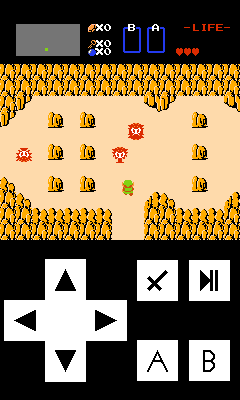

# BjneAsha
A port of the NES emulator Bjne by tanakh to Nokia Asha 311.
May work on other 240x400 resolution touch Java ME phones.
I don't know how to port the sound code so there isn't any sound.
There's an issue where the colors should be green they're yellow instead.
I've marked the commented out sound code with //SOUNDCODE.

